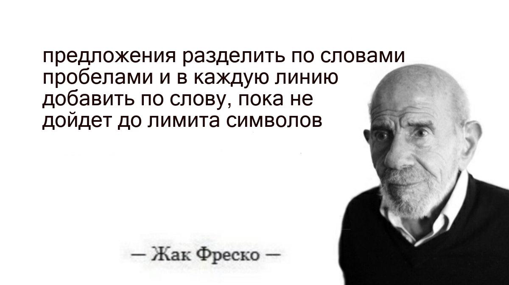

# Module drawingText
___
A module for drawing text on an image with text separation by lines
___
### Example

```python3
from dev.pillow_draw_text import write_in_image

text = "предложения разделить по словам пробелами и в каждую линию добавить по слову, пока не дойдет до лимита символов"
draw_img = write_in_image(
    'media/Jak_fresko.jpg',  # image for draw text
    text,  # text
    xy=(100, 100),  # left and top
    width=600,  # width located text
    height=574)  # height located text
draw_img.show()
```


